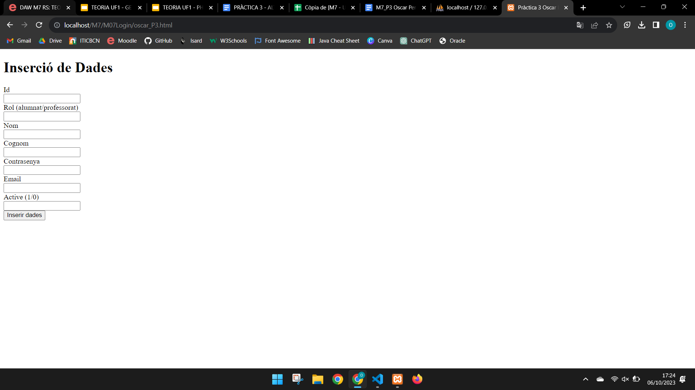
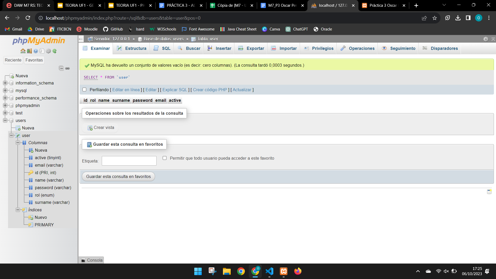
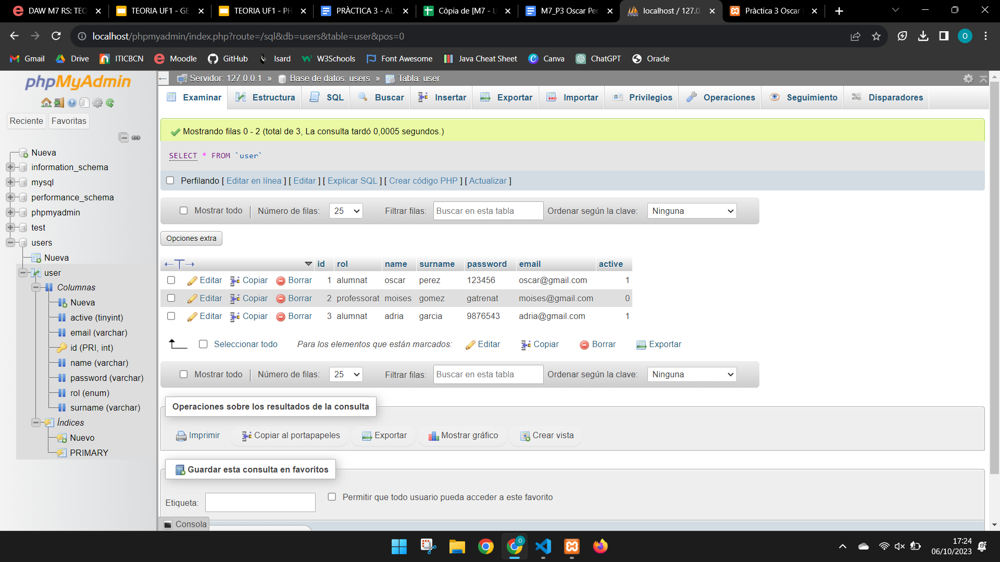

# ALTA USUARI AMB PHP I SQL
**Nom: Oscar Pérez**

## Feina Individual / Grupal

A través d’un formulari en php (amb totes les etiquetes html en format DOCTYPE) afegir les dades d’usuaris (alumnat i professorat).

- A phpmyadmin, crear una BBDD de nom Users i la taula de nom user.  

- A la taula user, afegir dades d’alumnat i professorat des d’un programa en php connectant-se a la BBDD Users.

    
Dades alumnat/professorat que han d’estar al formulari:

- id (**PK INT**)
- rol (alumnat, professorat) (**ENUM**)
- name (**VARCHAR, 255**)
- surname (**VARCHAR, 255**)
- password (**VARCHAR, 255**)
- email (**VARCHAR, 255**)
- active (si l’usuari té la compte activa o bloquejada) (**BOOL**)

**(La part de frontend no ha de ser complexa. Es recomana utilitzar una plantilla de [getbootstrap](https://getbootstrap.com/docs/5.3/getting-started/introduction/))**

## Resposta Execució

Captura de pantalla mostrant com queda l’execució de l’arxiu en l’explorador:

Captura de pantalla de la BBDD a phpmyadmin ABANS d’afegir dades:

Captura de pantalla de la BBDD a phpmyadmin DESPRÉS d’afegir dades:
